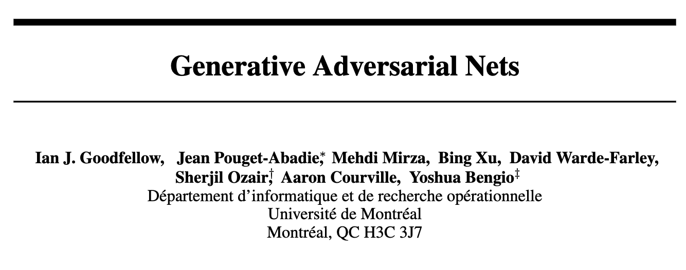
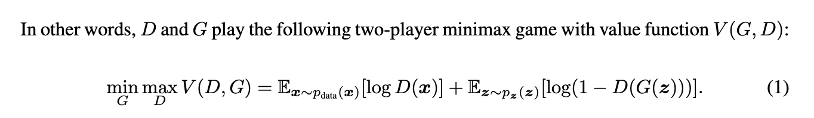
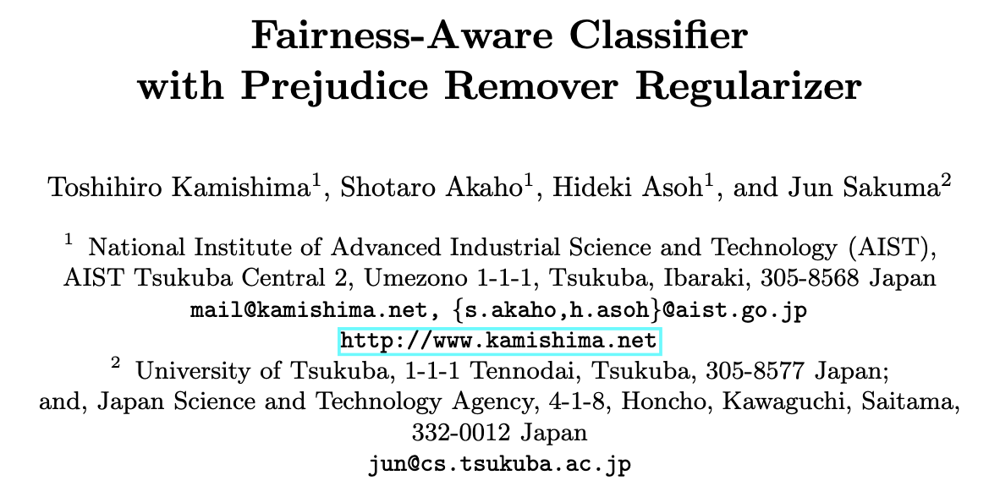
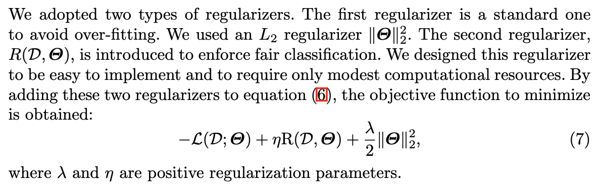

This is a written version of the presentation delivered at ITiCSE 2026 for the position paper, *"Proposing Threshold Concepts in Machine Learning"* [@zhang2026threshold]. It is a more visual presentation of the key elements of the content, and summarizes the main conversations that happened at the discussion portion of the talk. Lisa created and delivered the presentation, and wrote up the discussion notes afterwards. Thus, these notes are most representative of her views and recollections. Claude Sonnet 5 was used to assist with editing this excerpt; unless otherwise noted, all ideas came from the authors. ::: {.on-this-page} **On this page** - [Introduction](#introduction) - [Threshold concepts](#threshold-concepts) - [The Five Proposed Threshold Concepts](#the-five-proposed-threshold-concepts) - [1 · Learning is Optimization](#learning-is-optimization) - [3 · Machine Learning Is an Empirical Science](#empirical-science) - [4 · ML Describes Geometric Processes](#geometric) - [Implications for ML pedagogy](#implications-for-ml-pedagogy) - [Discussion](#discussion) ::: ## Introduction There is quite a bit of work recently on “what is important to teach in machine learning,” including Computing Research Association's [LEVEL UP AI initiative](https://cra.org/level-up-ai/) [@cra2024levelup], the ACM's 2023 Computer Science Curricular Guidelines [@kumar2023computer], among others. This work provides another perspective through the lens of threshold concepts. Since this is a position paper, we start with our own positionality. :::: {.authors-row} ::: {.author}  **Lisa Zhang**<br>[University of Toronto Mississauga]{.muted} - Associate Professor, Teaching - MSc in ML (Toronto, Vector) - Teaching ML since 2018: intro ML, deep learning, applied AI, AI safety - ML/CS Education research - EAAI co-chair 2026/2027; TOCE AE ::: ::: {.author}  **Gosia Migut**<br>[Delft University of Technology]{.muted} - Assistant Professor - PhD in explainable ML (UvA) - Teaching ML since 2012 - Hosts TU Delft ML Teacher Community - ML Education Research; CS Education Research ::: ::: {.author}  **Jesse Krijthe**<br>[Delft University of Technology]{.muted} - Assistant Professor - PhD in ML (Leiden) - Teaching: Intro ML BSc (6×), Advanced ML MSc (6×), 50+ student projects - Research: ML methodology & theory, causal inference, healthcare ::: :::: Lisa is teaching faculty at the University of Toronto in Canada; Gosia and Jesse are both researchers at Delft University of Technology in the Netherlands. Gosia is more on the education side and Jesse is an ML researcher. We are all active in computing education and machine learning education in some form, with leadership roles both in our local context and more broadly. The idea for this paper had been on Lisa's mind for a while, for two separate reasons. 1. ML courses tend to overwhelm students with a huge volume of models, ideas, and skills to cover, and it is not obvious what to prioritize. 2. Lisa works alongside writing-studies faculty who have had real success restructuring introductory academic writing courses around the threshold concepts framework. When the three of us met at ITiCSE the year before, we decided to explore what threshold concepts in ML might look like — this paper, and this post, are the result. ## Threshold concepts As a quick background: threshold concepts were proposed in 2003 [@meyer2003threshold] as a pedagogical framework and theory of learning centered on transformative experiences. They are "like a portal" that makes accessible a way to understand the world through the lens of a particular discipline. :::: {.quote-figure}  ::: {.bigquote} "...akin to a portal, opening up a new and previously inaccessible way of thinking about something. It represents a transformed way of understanding, or interpreting, or viewing something without which the learner cannot progress."<br>— @meyer2003threshold ::: :::: Threshold concepts are generally understood to have five characteristics, and in this work we lean most heavily on the first three — they are the ones usually treated as more load-bearing: :::: {.char-cards} ::: {.card} **Transformative** Fundamentally shifts the learner's perspective ::: ::: {.card} **Troublesome** Difficult to grasp; conflicts with the learner's prior understanding ::: ::: {.card} **Integrative** Unifies disparate concepts within a domain ::: ::: {.card} **Irreversible** Once understood, unlikely to be unlearned ::: ::: {.card} **Bounded** Limited to specific disciplinary boundaries ::: :::: Threshold concepts are **transformative** in that they shift perspectives. Threshold concepts are **troublesome** in that they tend to be difficult for learners, so much that learners typically have to pass through a **liminal space** — a state of "being in between" where understanding can look like mimicry rather than genuine mastery [@meyer2003threshold], and where learners may fall back on ritualistic, formulaic behaviour before they truly cross the threshold [@land2005implications]. And threshold concepts are **integrative** in that they unite many seemingly different ideas in a discipline. Examples of threshold concepts range from "opportunity cost" [@meyer2003threshold] in economics, to "pointers" [@boustedt2007threshold] in CS, to broader ideas like viewing "writing as a social and rhetorical activity" [@adler2015naming]. So here, what counts as a "concept" can vary in granularity. :::: {.ex-cards} ::: {.card} **Economics** ::: {.img-placeholder} ⚖️ ::: "Opportunity cost" ::: ::: {.card} **Computer Science** ::: {.img-placeholder} 💻 ::: Pointers; Object-Oriented Programming ::: ::: {.card} **Writing** ::: {.img-placeholder} ✍️ ::: "Writing is a Social and Rhetorical Activity" ::: :::: We take a broader approach, much like the writing pedagogy idea on the right above, in hopes of identifying model-agnostic ideas that will stand the test of time. We are also inspired by AI4K12's "five big ideas" in AI [@touretzky2019envisioning], a very impactful work in the field. So, unlike the CS2023 curricular guidelines, we are not looking at "important topics," disciplinary structure, "core ideas," or which specific models we should teach. We are instead centering on the transformative experiences we wish learners to undergo. Threshold concepts are usually identified through **consensus** [@barradell2013identification; @timmermans2019framework], for example, via a Delphi process. We did not do that. Instead, the three of us went for *depth rather than breadth*, and *usefulness rather than rigour*. We used a process with these steps: :::: {.ex-cards} ::: {.card} **1. Brainstorm** Independent brainstorming from our teaching + research experience ::: ::: {.card} **2. Discuss** Several rounds of discussion on these candidate concepts, where many candidates were combined ::: ::: {.card} **3. Ground** Ground the arguments in prior work in ML research, ML education, and ML/AI misconceptions ::: :::: We do not claim exhaustiveness in the concepts we propose: there may be more. We do see this work as both providing immediate value for structuring existing and new courses, and as a starting point for broader discussion. We should also mention that whether TCs can be identified with empirical rigour at all is contested [@rowbottom2007demystifying; @rountree2009issues]. It is partially why work in CS threshold concepts has slowed down, and partially why we took this approach. ## The Five Proposed Threshold Concepts We came up with the figure below to show the five proposed threshold concepts. The figure intentionally shows the inter-relations between the broad ideas. ```{=html} <div class="jigsaw"> </div> ``` "Learning is Optimization" sits at the centre. To the right are the transformations we want students *applying* ML models to undergo: understanding the tradeoffs in the sources of error, and viewing ML application as an empirical discipline — its epistemology grounded in experimentation, not derivation. To the left are the transformations we think matter for understanding ML *theory* — what we want students *developing new* ML models to undergo: seeing machine learning not just procedurally, but as geometric processes, and also probabilistic processes. The presentation proceeds to cover three of the concepts, to provide a sense of the kinds of arguments made in the paper. ## 1 · Learning is Optimization {#learning-is-optimization .tc-section .tc1-section} The word "learning" evokes a complex psychological process [@marx2024misconceptions]. But when we define a learning method, we actually turn a learning problem into an optimization problem. We define: * the search space (characterized by the model class), * the loss function (the thing we optimize), and * an optimization algorithm (like gradient descent). Through this framing, the abstract idea of "learning" gets turned into a concrete mathematical process. For example, in supervised learning we minimize empirical risk over a dataset: $$ \min_{f \in \mathcal{F}} \; \frac{1}{n}\sum_{i=1}^{n} \ell\big(f(x_i),\, y_i\big) $$ and in reinforcement learning we maximize expected discounted return, e.g. via Q-learning: $$ \max_{\pi} \; \mathbb{E}_{\tau \sim \pi}\Big[\textstyle\sum_{t=0}^{T} \gamma^t r_t\Big] $$ **Troublesome.** This is a troublesome idea for novices because it is counter to their preconceptions. In the literature, we see evidence [@marx2024misconceptions; @bewersdorff2023myths] that novices hold prior beliefs that: :::: {.ex-cards} ::: {.card} ::: {.icon-placeholder} 🧠 ::: ML works similarly to the **human brain** ::: ::: {.card} ::: {.icon-placeholder} ⚙️ ::: ML behaviour is **programmed** rather than learned ::: ::: {.card} ::: {.icon-placeholder} 💾 ::: Training data is **stored** inside the model ::: :::: **Transformative.** The idea is transformative in that it demystifies "learning" so it becomes a mechanical procedure rather than an intuitive notion. This shift is what lets researchers *construct* and *communicate* new ML methods by simply specifying an optimization problem. For example, @goodfellow2014generative introduce the Generative Adversarial Network with this objective: ::: {.paper-figs}   ::: As you can see, the paper introduces the approach by presenting the objective. There is a paragraph above this equation that describes it, along with discussion about how to make the optimization process work, but the equation does the heavy lifting in communicating the novel approach. The shift also allows practitioners to influence the behaviour of a model by modifying the objective. This paper on algorithmic fairness [@kamishima2012fairness] is an example, where a preference for a certain fairness notion is encoded with this middle term "R": ::: {.paper-figs}   ::: **Integrative.** This concept offers an integrative view of ML. We already saw that the same lens describes supervised, unsupervised, and reinforcement learning. Here is an unsupervised learning example. We typically introduce $k$-means clustering procedurally: alternating between a reassignment step, a refitting step, and repeating. You can see this process below: ```{=html} <div class="kmeans-widget"> <svg class="kmeans-svg"></svg> <div class="kmeans-panel"> <div class="kmeans-info">Iteration 0 — click to begin</div> <button class="kmeans-btn">Next step: re-assignment</button> <button class="kmeans-reset">↺ Reset</button> </div> </div> ``` However, this procedural description is nothing more than block coordinate descent on this objective! $$ J = \sum_{i=1}^{n} \lVert x_i - \mu_{c(i)} \rVert^2 $$ Thus, the integrative power comes from being able to systematically reason about "what is this process implicitly optimizing?" to understand a new method — and to modify it. This AI alignment example was also included in the slide but not discussed in the presentation. Specifically, issues of AI alignment fall out of this concept as a natural extension: does a system do what its designers *intended*, or only what its objective literally rewards? Alignment is thus essentially an application of **Goodhart's Law**: "when a measure becomes a target, it ceases to be a good measure." ```{=html}  ``` Modern examples include hallucination in LLMs (a side effect of optimizing for next-token prediction) and sycophancy in LLMs trained with RLHF. These are both instances of the same underlying pattern: the objective for the mathematical optimization encourages behaviour that deviates from what is desired. ## 3 · Machine Learning Is an Empirical Science {#empirical-science .tc-section .tc3-section} This is an "applied ML" concept, and the term "**Empirical**" means grounded in observation and experimentation, rather than using theoretical or abstract reasoning. This is related to the **No Free Lunch** theorem [@wolpert1996lack], also in the CS2023 Curricular Guidelines. You might have seen or used a diagram like this in your classes to show part of the model-building process, where we: train multiple models (maybe with different hyperparameters, model families, feature selection); set aside a validation set to support empirical experimentation to find the "best" choice; and use a test set for estimating generalization accuracy — again empirically. ```{=html} <div id="workflow-diagram" style="display: inline-block; width: 100%;"></div> ``` It is tempting to assume a certain input distribution and use theory to guide these choices, but real data is messy! Especially in high-stakes settings, nothing else can replace empirical exploration. **Transformative.** A key transformation that we want learners to undergo is to move away from thinking about the "best algorithm" under whatever assumption. Instead, think more like a scientist performing experiments to find a good Problem-Data-Model alignment for their learning problem. Therefore, questions related to proper evaluation, like selecting the right dataset and splitting it appropriately, all become central. ::: {.shift-diagram} ::: {.old} ```{=html} <div class="old-icon">🔍</div> ``` **"Best algorithm"** ::: ::: {.shift-arrow-wrap} [→]{.shift-arrow} ```{=html} <svg viewBox="0 0 380 300" class="pdm-triangle"> <defs> <marker id="pdm-arrow-fwd" viewBox="0 0 10 10" refX="9" refY="5" markerWidth="8" markerHeight="8" orient="auto"> <path d="M0,0 L10,5 L0,10 z" fill="#eda100"/> </marker> <marker id="pdm-arrow-back" viewBox="0 0 10 10" refX="1" refY="5" markerWidth="8" markerHeight="8" orient="auto"> <path d="M10,0 L0,5 L10,10 z" fill="#eda100"/> </marker> </defs> <line x1="162.2" y1="83.2" x2="97.8" y2="206.8" stroke="#eda100" stroke-width="3" marker-start="url(#pdm-arrow-back)" marker-end="url(#pdm-arrow-fwd)"/> <line x1="130" y1="260" x2="250" y2="260" stroke="#eda100" stroke-width="3" marker-start="url(#pdm-arrow-back)" marker-end="url(#pdm-arrow-fwd)"/> <line x1="282.2" y1="206.8" x2="217.8" y2="83.2" stroke="#eda100" stroke-width="3" marker-start="url(#pdm-arrow-back)" marker-end="url(#pdm-arrow-fwd)"/> <circle cx="190" cy="183" r="48" fill="#eda100"/> <text x="190" y="190" text-anchor="middle" font-size="22" font-weight="700" fill="#ffffff">Evaluate</text> <rect x="135" y="5" width="110" height="50" rx="8" fill="rgba(237,161,0,0.1)" stroke="#eda100" stroke-width="2"/> <text x="190" y="36" text-anchor="middle" font-size="22" font-weight="700" fill="#0b0b0b">Problem</text> <rect x="15" y="235" width="110" height="50" rx="8" fill="rgba(237,161,0,0.1)" stroke="#eda100" stroke-width="2"/> <text x="70" y="266" text-anchor="middle" font-size="22" font-weight="700" fill="#0b0b0b">Data</text> <rect x="255" y="235" width="110" height="50" rx="8" fill="rgba(237,161,0,0.1)" stroke="#eda100" stroke-width="2"/> <text x="310" y="266" text-anchor="middle" font-size="22" font-weight="700" fill="#0b0b0b">Model</text> </svg> ``` ::: ::: There is also a second transformative shift, where we want learners to shift from optimizing for a single metric like "accuracy" into really understanding "how, why, and for whom the model works." This means thinking about fairness, efficiency, robustness, interpretability, sustainability---and all of those require empirical evaluation and systematic model auditing. ::: {.shift-diagram} ::: {.old} ```{=html} <div class="old-icon">🎯</div> ``` **"Accuracy"** ::: ::: {.shift-arrow-wrap} [→]{.shift-arrow} ```{=html} <svg viewBox="0 0 766 604" class="pdm-triangle pdm-triangle-radial" style="width: 340px;"> <defs> <marker id="pdm-arrow-fwd2" viewBox="0 0 10 10" refX="9" refY="5" markerWidth="11" markerHeight="11" orient="auto"> <path d="M0,0 L10,5 L0,10 z" fill="#eda100"/> </marker> </defs> <line x1="393.8" y1="101.0" x2="393.8" y2="228.0" stroke="#eda100" stroke-width="4" marker-end="url(#pdm-arrow-fwd2)"/> <line x1="551.1" y1="276.9" x2="488.9" y2="297.1" stroke="#eda100" stroke-width="4" marker-end="url(#pdm-arrow-fwd2)"/> <line x1="522.6" y1="505.3" x2="452.6" y2="408.9" stroke="#eda100" stroke-width="4" marker-end="url(#pdm-arrow-fwd2)"/> <line x1="264.9" y1="505.3" x2="335.0" y2="408.9" stroke="#eda100" stroke-width="4" marker-end="url(#pdm-arrow-fwd2)"/> <line x1="248.1" y1="280.7" x2="298.7" y2="297.1" stroke="#eda100" stroke-width="4" marker-end="url(#pdm-arrow-fwd2)"/> <circle cx="393.8" cy="328.0" r="80" fill="#eda100"/> <text x="393.8" y="336.8" text-anchor="middle" font-size="25" font-weight="700" fill="#ffffff">Evaluate</text> <rect x="318.8" y="15.0" width="150" height="66" rx="10" fill="rgba(237,161,0,0.1)" stroke="#eda100" stroke-width="2"/> <text x="393.8" y="56.0" text-anchor="middle" font-size="23" font-weight="700" fill="#0b0b0b">Fairness</text> <rect x="570.1" y="208.5" width="180" height="66" rx="10" fill="rgba(237,161,0,0.1)" stroke="#eda100" stroke-width="2"/> <text x="660.1" y="249.5" text-anchor="middle" font-size="23" font-weight="700" fill="#0b0b0b">Efficiency</text> <rect x="468.4" y="521.5" width="180" height="66" rx="10" fill="rgba(237,161,0,0.1)" stroke="#eda100" stroke-width="2"/> <text x="558.4" y="562.6" text-anchor="middle" font-size="23" font-weight="700" fill="#0b0b0b">Robustness</text> <rect x="101.7" y="521.5" width="255" height="66" rx="10" fill="rgba(237,161,0,0.1)" stroke="#eda100" stroke-width="2"/> <text x="229.2" y="562.6" text-anchor="middle" font-size="23" font-weight="700" fill="#0b0b0b">Interpretability</text> <rect x="15.0" y="208.5" width="225" height="66" rx="10" fill="rgba(237,161,0,0.1)" stroke="#eda100" stroke-width="2"/> <text x="127.5" y="249.5" text-anchor="middle" font-size="23" font-weight="700" fill="#0b0b0b">Sustainability</text> </svg> ``` ::: ::: **Troublesome.** Despite the use of the emoji below, none of our students actually cried. However, we did have students who were upset and found it difficult to accept that theory alone was not enough. At least in some of our contexts, we feel that students are not really taught how to perform empirical experiments to produce knowledge. This is probably why doing empirical evaluation well can also be hard for experts, leading to field-wide issues like reproducibility and others. :::: {.ex-cards .two} ::: {.card} ::: {.icon-placeholder} 😭 ::: **Theory alone is not enough** Accepting that theory cannot determine the "best" model is unsatisfying ::: ::: {.card} ::: {.icon-placeholder} 🧪 ::: **Good evaluation is a skill** Not always taught explicitly; reproducibility is a field-wide concern ::: :::: **Integrative.** This is an integrative concept, kind of by design. The need for empirical evaluation is a lens through which we can interpret many failure modes, including these: :::: {.ex-cards .four} ::: {.card} ```{=html} <div class="icon-placeholder">⚖️</div> ``` **Overfitting & underfitting** ::: ::: {.card} ```{=html} <div class="icon-placeholder">🎛️</div> ``` **Lack of hyperparameter exploration** ::: ::: {.card} ```{=html} <div class="icon-placeholder">🗂️</div> ``` **Bias in training data** ::: ::: {.card} ```{=html} <div class="icon-placeholder">💧</div> ``` **Data leakage** ::: :::: We are taking the perspective that issues of unintentional, unanticipated harm are within the bounds of our discipline. ## 4 · ML Describes Geometric Processes {#geometric .tc-section .tc4-section} The remaining two concepts are more theoretical, relating to geometry and probability. Both sound very broad, but the claims made in the paper are more specific, and we hope readers give those arguments a chance. Consider geometry, for example. **Transformative.** Here are a couple of quotes that illustrate how machine learning practitioners talk: > "Natural images lie on a manifold within $\mathbb{R}^D$" > "The earlier layers of a Multi-Layer Perceptron learn features, and the final layer is a linear classifier on these features" There are two transformations here that learners need to undergo to understand language like this. The first is to think of data---any data, be it image, text, or graphs---as geometric objects. "Geometry" entails that with good representation, meaning comes from distances, symmetries, invariances, and so on. Through this lens we can accept representations like word embeddings, where the axes do not provide meaning, but the distances and relationships between words do. One can then think of models as acting on the data space as a whole, making these distortions and "learning features." A second transformation is thinking of models as geometric objects too — also with distances, symmetries, and so on — and optimizers as acting on these objects. :::: {.ex-cards .two} ::: {.card} **Data as geometric objects** Points in $\mathbb{R}^D$ with meaningful distances, symmetries, invariances; models as geometric processes that distort this space ::: ::: {.card} **Models as geometric objects** ...with meaningful distances, symmetries, invariances; optimizers as geometric processes navigating this space ::: :::: **Troublesome.** But this is troublesome. Earlier CS courses emphasize differences in data type and their representations. Also, empirical evidence [@sibia2025student] suggests that students find it hard to connect algebraic and geometric views. :::: {.ex-cards .two} ::: {.card} ::: {.icon-placeholder} 🌀 ::: **Connecting Algebraic and Geometric Views** ::: ::: {.card} ::: {.icon-placeholder} 📚 ::: **Counters prior CS training** Earlier courses emphasize data *type* (chars, pixels, waveforms) and time/space complexity ::: :::: **Integrative.** However, once understood, geometry provides a lens to answer questions about what data representations work well, shapes model design that exploits symmetries, and shapes how we tackle the optimization problem. :::: {.ex-cards} ::: {.card} ```{=html} <div class="icon-placeholder">🔢</div> ``` **Data geometry** Shapes what can be learned — why one-hot encode categorical variables? why use a distributed representation? ::: ::: {.card} ```{=html} <div class="icon-placeholder">🕸️</div> ``` **Model geometry** Shapes what models are possible — CNNs & GNNs exploit symmetries; embeddings & transfer learning ::: ::: {.card} ```{=html} <div class="icon-placeholder">🏔️</div> ``` **Loss geometry** Shapes how we find good models — gradient descent + momentum, step sizes, clipping, ravines ::: :::: ## Implications for ML pedagogy Threshold concepts are generally used to identify the few pivotal ideas to organize teaching around, rather than covering a discipline's topics exhaustively. This is especially useful in ML, where new models and methods arrive constantly, and students already report being overwhelmed [@sibia2025student]. :::: {.ex-cards} ::: {.card} ::: {.icon-placeholder} 🔄 ::: **Transformative concepts** Rather than exhaustive topic coverage ::: ::: {.card} ::: {.icon-placeholder} ⏳ ::: **Liminal time** Build in time to work through liminal phases ::: ::: {.card} ::: {.icon-placeholder} ✅ ::: **Real assessment** Design assessments that reveal transformation, not mimicry ::: :::: **For new courses and curricula** For new courses, some of these concepts might be starting points for deciding what those "pivotal ideas" might be. Not all courses might use all of these concepts, depending on what transformations we want the learners to go through. The more "applied" courses might stay to the right, for example. ```{=html} <div class="jigsaw jigsaw-small"> </div> ``` We did put "learning as optimization" right in the centre, and we do think that this is still important. **For existing ML courses** Even without fully redesigning a course, you can use these threshold concepts as recurrent threads tying different models together. Here's an example of an ML course schedule taken from one of our institutions, which will keep this schedule for the time being. In fact, a lot of machine learning textbook tables of contents also look like this, with a list of topics with very little connection between them. ::: {.syllabus-table} | Week | Lecture Topic | |---|---| | 1 | Supervised Learning; Nearest Neighbours | | 2 | Decision Trees | | 3 | Linear Regression | | 4 | Feature Mapping; Classification | | 5 | Multi-Class Classification; Multi-Layer Perceptrons | | 6 | Neural Networks; Backpropagation | | 7 | Bias-Variance Decomposition; Probabilistic Modeling | | 8 | Algorithmic Fairness | | 9 | Naive Bayes | | 10 | Gaussian Discriminant Analysis | | 11 | Clustering; Mixture Models; Expectation Maximization | | 12 | Principal Component Analysis | ::: If you have a course like this, and don't want to make large changes yet, it is still possible to use these concepts as a consistent thread repeated throughout the course. This repetition helps to ensure that key transformations actually happen. For example, in the Decision Trees unit, we can emphasize: what is the optimization problem? How is it broken down? What are the key geometric ideas? What tradeoffs are salient? How are the answers different from, say, Naive Bayes? Without that connective tissue, it is harder for students to tell what is foundational and cross-cutting across all these topics. ### How much math do students need? There is also this question of how much math is really necessary in ML education [@shapiro2019introduction]. Our answer is that for the first three, more applied concepts, we think learners can cross with minimal calculus, linear algebra, and probability — understanding ML as empirical, and the multifaceted nature of evaluation, do not take much math at all. ::: {.columns .bottom-align} ::: {.column width="27%"} Math maturity is an important pre-liminal variation ::: ::: {.column width="46%"} ```{=html} <div class="jigsaw jigsaw-small"> </div> ``` ::: ::: {.column width="27%"} Learners can cross the threshold with minimal math ::: ::: However, for the last two, more theoretical concepts, math maturity becomes an important *pre-liminal variation* [@rountree2009issues; @meyer2003threshold]: without it, learners can still enter the liminal space, but they struggle to fully "negotiate" their way across it, and stay at the level of mimicry rather than real understanding. That said, math self-efficacy remains a real barrier, and teaching students without a deep math background is still crucial. With careful, tailored instruction they can go far, even if the transformation does not end up fully irreversible. ## Discussion Here are a few discussion points following the presentation. The presenter is grateful for the productive and friendly discussion, as is typical of the ITiCSE culture. **Should "learning is optimization" be "learning is function approximation"?** Many textbooks frame learning as function approximation, and so "function approximation" may be a more commonly accepted perspective for describing learning. Lisa expressed a concern that this framing is too broad: i.e., many AI techniques that are not ML involve function approximation. Writing code by hand, without any "learning," can also be thought of as approximating a "function" or a real-world process/phenomenon. **Are there ML textbooks that use this "Threshold Concept" approach?** Not that we are aware. Lisa pointed out books with alternative framing, like Alex Jung's textbook [@jung2022machine] that uses a Data-Model-Loss decomposition. The modular approach to ML is something more typically discussed. Lisa regrets not thinking of this at the time, but Russell & Norvig's AI textbook discusses a similar "standard model" framing of AI where an AI system is built to optimize a fixed, known objective [@russell2021artificial]. **Connections to the "Math Wars"**: The **Math Wars** [@schoenfeld2004math] refers to a long-running debate in K-12 math education between "reform" approaches (emphasizing conceptual understanding and discovery) and "traditional" approaches (emphasizing procedural fluency and direct instruction). An attendee drew a parallel to our discussion, along with the potential disagreements that could be raised. **Is kNN optimization?** This was discussed privately after the Q&A, and is an interesting example. kNN has no training-time optimization, and can be thought of as having "no learning." We did not think of this at the time, but Claude Sonnet 5 suggested a resolution: in kNN, the "optimization" is deferred to inference-time. This idea is consistent with conversations we had with colleagues who described thinking of the "learning" stage of developing an ML model as "amortizing" inference-time computation: kNN has no amortization. **Are these concepts really bounded?** Again, this was brought up privately. Compiler optimization was discussed as a counter-example, which we (after talking to some programming languages folks) disagree with. However, we agree that "boundedness" was the hardest section to argue, and that in the threshold concepts literature, "boundedness" is a criterion that has contention and is not always considered required [@yeomans2019transformative]. **Are you creating a course based on this?** Not yet. Our current plans are described above. We are grateful for the discussion. As a caveat, this was a written summary of Lisa's biased recollection, which tended to focus more on the pushback. All discussion points, including the ones not written down, were appreciated!