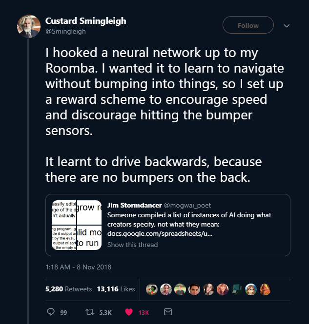

## Who We Are :::: {.authors-row} ::: {.author}  **Lisa Zhang**<br>[University of Toronto Mississauga]{.muted} - Associate Professor, Teaching - MSc in ML (Toronto, Vector) - Teaching ML since 2018: intro ML, deep learning, applied AI, AI safety - ML/CS Education research - EAAI co-chair 2026/2027; TOCE AE ::: ::: {.author}  **Gosia Migut**<br>[Delft University of Technology]{.muted} - Assistant Professor - PhD in explainable ML (UvA) - Teaching ML since 2012 - Hosts TU Delft ML Teacher Community - ML Education Research; CS Education Research ::: ::: {.author}  **Jesse Krijthe**<br>[Delft University of Technology]{.muted} - Assistant Professor - PhD in ML (Leiden) - Teaching: Intro ML BSc (6×), Advanced ML MSc (6×), 50+ student projects - Research: ML methodology & theory, causal inference, healthcare ::: :::: ::: {.positionality} **28 years of combined ML teaching** · North America + Europe <br> undergrad and graduate · educator and researcher ::: ::: {.notes} This is a position paper so let me talk a bit about our positionality. My name is Lisa Zhang, I am a teaching faculty at the University of Toronto in Canada. My two colleagues are both from the Delft University of Technology in the Netherlands, and both regret not being able to make it to ITiCSE. Gosia is more on the education-side and Jesse is an ML researcher. We are all active in CSEd education and machine learning education, with leadership roles both in our local context and more broadly. This idea of Threshold Concept was on my mind for several years for a few reasons. - ML courses tend to be overwhelming for students with lots of models, ideas, skills to cover. - …and separately I work with writing studies faculty who had success structuring introductory academic writing courses through the TC framework. And when the three of us met last year following ITiCSE, we decided to explore ML TC more deeply ::: ## Threshold Concepts :::: {.columns} ::: {.column width="25%"} {height="300"} ::: ::: {.column width="75%"} ::: {.bigquote} "...akin to a portal, opening up a new and previously inaccessible way of thinking about something. It represents a transformed way of understanding, or interpreting, or viewing something without which the learner cannot progress." — [@meyer2003threshold] ::: ::: :::: ::: {.notes} As a quick background: threshold concepts were proposed in 2003 [@meyer2003threshold] as a pedagogical framework and theory of learning centered on transformative experiences. They're "like a portal" that makes accessible a way to understand the world through the lens of a particular discipline. Threshold concepts are generally thought to have these five properties. We'll focus on the first three today, as they're seen as the more load-bearing ones. A TC is **transformative** in that it shifts perspectives. It is troublesome, in the sense that it tends to be difficult for learners — so much that learners need to transition through what's called the **"liminal space,"** where they exhibit signs of mimicry rather than true understanding. And a TC is **integrative** in that it unites many seemingly different ideas in a discipline. ::: . . . ::: {.char-cards} ::: {.card} **Transformative** fundamentally shifts the learner's perspective ::: ::: {.card} **Troublesome** difficult to grasp; conflict with prior understanding ::: ::: {.card} **Integrative** unifies disparate concepts in a domain ::: ::: {.card} **Irreversible** once understood, unlikely to be unlearned ::: ::: {.card} **Bounded** limited to specific disciplinary boundaries ::: ::: ## Examples of Threshold Concepts ::: {.ex-cards} ::: {.card} **Economics** ::: {.img-placeholder} ⚖️ ::: "Opportunity cost" [@meyer2003threshold] ::: ::: {.card} **Computer Science** ::: {.img-placeholder} 💻 ::: Pointers; object-orientation [@boustedt2007threshold] ::: ::: {.card} **Writing** ::: {.img-placeholder} ✍️ ::: "Writing is a Social and Rhetorical Activity" [@adler2015naming] ::: ::: ::: {.notes} Examples of threshold concepts include "opportunity cost" in economics, to "pointers" in CS, to broader ideas like viewing "writing as a social and rhetorical activity." So here, what counts as a "concept" can vary in granularity. We take a broader approach, much like what you see on the right, in hopes of identifying model-agnostic ideas that will stand the test of time. We're also inspired by AI4K12's "five big ideas" in AI, if you're familiar with that. So, unlike the CS2023 curricular guidelines, we're not looking at "important topics," disciplinary structure, "core ideas," or which specific models we should teach. We're instead centering on the transformative experiences we wish learners to undergo. ::: . . . **Concept granularity**: ours will be broad, field-level ideas . . . ...like the AI4K12 "five big ideas" [@touretzky2019envisioning] ## Our Process Threshold concepts are usually identified through **consensus** [@barradell2013identification; @timmermans2019framework] ::: {.notes} Threshold concepts are usually identified through consensus among many experts, for example, through a Delphi process. We did not have a large group of experts. Instead, the three of us went for depth rather than breadth, usefulness rather than rigour. We started with individual brainstorming, then held many rounds of discussion, and finally grounded our write-up of each proposed concept in the relevant literature. We don't claim exhaustiveness. But we see this work as both providing immediate value for structuring existing and new courses, and as a starting point for broader discussion. I should also mention that whether TCs can be identified with empirical rigor at all is contested, which is partially why work in CS threshold concepts has slowed down, and a partially why we took this appraoch. ::: . . . Our approach: ::: {.ex-cards} ::: {.card} **1. Brainstorm** Independent brainstorming from our teaching + research experience ::: ::: {.card} **2. Discuss** Several rounds of discussion on these candidate concepts ::: ::: {.card} **3. Ground** Ground the arguments in prior work in ML research, ML education & ML/AI misconceptions ::: ::: . . . Whether TCs can be identified with empirical rigor at all is contested [@rowbottom2007demystifying; @rountree2009issues] ## What we brainstormed {auto-animate="true"} ```{=html} <div class="stickies"> <div class="note" data-id="n1">Learning is Optimization</div> <div class="note" data-id="n2">Bias/Variance: ML models are not<br>perfect</div> <div class="note" data-id="n3">Model evaluation is empirical</div> <div class="note" data-id="n4">&ldquo;No Free Lunch&rdquo;</div> <div class="note" data-id="n5">Learning = Data + Algorithm</div> <div class="note" data-id="n6">Different hyperparameter choices are essentially different models</div> <div class="note" data-id="n7">Representation: everything is a vector</div> <div class="note" data-id="n8">Data arise from probabilistic phenomena</div> <div class="note" data-id="n9">The role of randomness</div> </div> ``` ::: {.notes} So here is an early list of ideas that we brainstormed. ::: ## …and how we grouped them {auto-animate="true"} ```{=html} <div class="stickies"> <div class="note tc1" data-id="n1">Learning is Optimization</div> <div class="note tc2" data-id="n2">Bias/Variance: ML models are not<br>perfect</div> <div class="note tc3" data-id="n3">Model evaluation is empirical</div> <div class="note tc3" data-id="n4">&ldquo;No Free Lunch&rdquo;</div> <div class="note tc3" data-id="n5">Learning = Data + Algorithm</div> <div class="note tc3" data-id="n6">Different hyperparameter choices are essentially different models</div> <div class="note tc4" data-id="n7">Representation: everything is a vector</div> <div class="note tc5" data-id="n8">Data arise from probabilistic phenomena</div> <div class="note tc5" data-id="n9">The role of randomness</div> </div> ``` ::: {.notes} In these early discussions, we realized that many ideas were And in these early discussions, we realized that many ideas were inter-related, and grouped them into these 5 major groups and named them. ::: ## …and how we grouped them {auto-animate="true"} ```{=html} <div class="group-board"> <div class="gcol"> <div class="zone z-tl"> <span class="zlabel">(4) ML Describes Geometric Processes</span> <div class="note tc4" data-id="n7">Representation: everything is a vector</div> </div> <div class="zone z-bl"> <span class="zlabel">(5) ML Demands a Probabilistic Lens</span> <div class="note tc5" data-id="n8">Data arise from probabilistic phenomena</div> <div class="note tc5" data-id="n9">The role of randomness</div> </div> </div> <div class="gcol centre"> <div class="zone z-c"> <span class="zlabel">(1) Learning is Optimization</span> <div class="note tc1" data-id="n1">Learning is Optimization</div> </div> </div> <div class="gcol"> <div class="zone z-tr"> <span class="zlabel">(2) There are Tradeoffs in Sources of Error</span> <div class="note tc2" data-id="n2">Bias/Variance: ML models are not<br>perfect</div> </div> <div class="zone z-br"> <span class="zlabel">(3) ML is an Empirical Science</span> <div class="note tc3" data-id="n3">Model evaluation is empirical</div> <div class="note tc3" data-id="n4">&ldquo;No Free Lunch&rdquo;</div> <div class="note tc3" data-id="n5">Learning = Data + Algorithm</div> <div class="note tc3" data-id="n6">Different hyperparameter choices are essentially different models</div> </div> </div> </div> ``` ::: {.notes} There are still inter-relations between these broad ideas, so we came up with this figure. ::: ## Five proposed threshold concepts ```{=html} <div class="jigsaw"> </div> ``` ::: {.notes} Seeing "learning as optimization" sits at the center. On the right are the key transformations we want students *applying* ML models to undergo: understanding the tradeoffs in the sources of error, and viewing ML application as an empirical discipline — its epistemology grounded in experimentation, not derivation. On the left are key transformations for understanding ML *theory* — what we want students *developing new* ML models to undergo: seeing machine learning not just procedurally, but as geometric processes, and also probabilistic processes. ::: # 1 · Learning is Optimization {.center-slide .tc1-slide} ```{=html} <div class="jigsaw jigsaw-mini highlight-1"> </div> ``` ::: {.notes} I'll go deep on a couple of these today to give you a sense of the kind of arguments we make in the paper, and move quickly through the rest — I hope you'll take a look at the others yourselves. Fair warning: we'll be talking about ML ideas in some depth here, so this next part will sound more like a class than a conference talk. Hopefully you'll get something out of it either way. ::: ## Learning is Optimization {.tc1-slide} To describe an ML method, we describe: - **search space** (model class) - **loss function** - **optimization algorithm** ::: {.stack-fade} ::: {.fragment .fade-out} Supervised Learning: minimize empirical risk $$ \min_{f \in \mathcal{F}} \; \frac{1}{n}\sum_{i=1}^{n} \ell\big(f(x_i),\, y_i\big) $$ ::: ::: {.fragment} Reinforcement Learning: maximize expected discounted return $$ \max_{\pi} \; \mathbb{E}_{\tau \sim \pi}\Big[\textstyle\sum_{t=0}^{T} \gamma^t r_t\Big] $$ ::: ::: ::: {.notes} So let's start at the center: learning as optimization. What does this mean? When we think of the word "learning," it sounds like a complex psychological process. But when we define a learning method, we actually turn a learning problem into an optimization problem. We define: the search space (characterized by the model class), the loss function (the thing we optimize), and an optimization algorithm (like gradient descent). Through this framing, the abstract idea of "learning" gets turned into a concrete mathematical process. For example, in supervised learning, where we minimize empirical risk across a dataset — and in reinforcement learning, where we maximize expected discounted return, using maybe Q-learning. ::: ## Learning is Optimization: Troublesome {.tc1-slide} Counters novices' beliefs that: ::: {.ex-cards} ::: {.card} ::: {.icon-placeholder} 🧠 ::: ML works similarly to the **human brain** [@marx2024misconceptions] ::: ::: {.card} ::: {.icon-placeholder} ⚙️ ::: ML behaviour is **programmed** rather than learned [@marx2024misconceptions] ::: ::: {.card} ::: {.icon-placeholder} 💾 ::: Training data is **stored** inside the model [@bewersdorff2023myths] ::: ::: ::: {.notes} This is a troublesome idea for novices because it's counter to their preconceptions. In the literature, we see evidence that novices hold prior beliefs that ML works like the brain, that it's programmed, or that training data is stored [@marx2024misconceptions; @bewersdorff2023myths]. ::: ## Learning is Optimization: Transformative {.tc1-slide} This shift lets researchers construct and communicate ML methods by specifying the optimization problem. ::: {.ex-cards .one .big} ::: {.card} {width="100%"} ⋮ {width="100%"} ::: ::: ::: {.notes} The idea is transformative in that it demystifies "learning" so it becomes a mechanical procedure rather than an intuitive notion. Once the threshold is crossed, practitioners construct and communicate new methods by specifying the optimization problem. For example, the GAN paper introduces the approach with this objective, where "G" is the generator and "D" is the discriminator — I'd argue this is the most important line in that paper. ::: ## Learning is Optimization: Transformative {.tc1-slide} ::: {.ex-cards .one .big} ::: {.card} {width="100%"} ⋮ {width="100%"} ::: ::: ::: {.notes} The shift also allows practitioners to influence the behaviour of a model by modifying the objective. This paper on algorithmic fairness is an example, where we can encode a preference for a certain fairness notion with this middle term "R" here. ::: ## Learning is Optimization: Integrative {.tc1-slide} Unsupervised learning: k-means clustering ```{=html} <div class="kmeans-widget"> <svg class="kmeans-svg"></svg> <div class="kmeans-panel"> <div class="kmeans-info">Iteration 0 — click to begin</div> <button class="kmeans-btn">Next step: re-assignment</button> <button class="kmeans-reset">↺ Reset</button> </div> </div> ``` ::: {.notes} Framing learning as optimization is integrative: we saw it in supervised and reinforcement learning, and in algorithmic fairness. Here's an unsupervised learning example. We typically introduce $k$-means clustering procedurally: alternating between a reassignment step, a refitting step, and repeating. But this process can be viewed as block coordinate descent on this objective! The integrative power is being able to systematically reason about "what is this process implicitly optimizing?" to understand a new method — and to modify it. ::: . . . **Block coordinate descent** on $J = \sum_{i=1}^{n} \lVert x_i - \mu_{c(i)} \rVert^2$ . . . Systematic reasoning: "What is this process implicitly optimizing?" ## Learning is Optimization: Integrative {.tc1-slide} **AI alignment**: does the system do what its designers *intended*, not just what the objective literally rewards? :::: {.columns} ::: {.column width="50%"} {height="400"} ::: ::: {.column width="50%"} **Goodhart's Law**: "When a measure becomes a target, it ceases to be a good measure" - hallucination in LLMs (optimizing for next-token prediction), - sycophancy in LLMs (RLHF) ::: :::: ::: {.notes} Issues of AI alignment become a natural extension. ::: # 3 · Machine Learning is an Empirical Science {.center-slide .tc3-slide} ```{=html} <div class="jigsaw jigsaw-mini highlight-3 done-1 done-2"> </div> ``` ::: {.notes} Let’s jump to Concept (3). ::: ## Machine Learning is an Empirical Science {.tc3-slide} **"Empirical"**: grounded in observation and experimentation ::: {.notes} This is an "applied ML" concept, and the term "Empirical" means grounded in observation and experimentation, rather than using theoretical or abstract reasoning. This is related to the "No Free Lunch" theorem, also in the CS2023 Curricular Guidelines. You might have seen or used a diagram like this in your classes to show part of the model-building process, where we: train multiple models (maybe with different hyperparameters, model families, feature selection); set aside a validation set to support empirical experimentation to find the "best" choice; and use a test set for estimating generalization accuracy — again empirically. It's tempting to assume a certain input distribution and use theory to guide these choices, but real data is messy! Especially in high-stakes settings, nothing else can replace empirical exploration. ::: . . . ```{=html} <div id="workflow-diagram" style="display: inline-block; width: 100%;"></div> ``` ## Machine Learning is an Empirical Science: Transformative {.tc3-slide} ::: {.shift-diagram} ::: {.old} ::: {.old-icon} 🔍 ::: **"Best algorithm"** ::: ::: {.fragment} ::: {.shift-arrow} → ::: ```{=html} <svg viewBox="0 0 380 300" class="pdm-triangle"> <defs> <marker id="pdm-arrow-fwd" viewBox="0 0 10 10" refX="9" refY="5" markerWidth="8" markerHeight="8" orient="auto"> <path d="M0,0 L10,5 L0,10 z" fill="#eda100"/> </marker> <marker id="pdm-arrow-back" viewBox="0 0 10 10" refX="1" refY="5" markerWidth="8" markerHeight="8" orient="auto"> <path d="M10,0 L0,5 L10,10 z" fill="#eda100"/> </marker> </defs> <line x1="162.2" y1="83.2" x2="97.8" y2="206.8" stroke="#eda100" stroke-width="3" marker-start="url(#pdm-arrow-back)" marker-end="url(#pdm-arrow-fwd)"/> <line x1="130" y1="260" x2="250" y2="260" stroke="#eda100" stroke-width="3" marker-start="url(#pdm-arrow-back)" marker-end="url(#pdm-arrow-fwd)"/> <line x1="282.2" y1="206.8" x2="217.8" y2="83.2" stroke="#eda100" stroke-width="3" marker-start="url(#pdm-arrow-back)" marker-end="url(#pdm-arrow-fwd)"/> <circle cx="190" cy="183" r="48" fill="#eda100"/> <text x="190" y="190" text-anchor="middle" font-size="22" font-weight="700" fill="#ffffff">Evaluate</text> <rect x="135" y="5" width="110" height="50" rx="8" fill="rgba(237,161,0,0.1)" stroke="#eda100" stroke-width="2"/> <text x="190" y="36" text-anchor="middle" font-size="22" font-weight="700" fill="#0b0b0b">Problem</text> <rect x="15" y="235" width="110" height="50" rx="8" fill="rgba(237,161,0,0.1)" stroke="#eda100" stroke-width="2"/> <text x="70" y="266" text-anchor="middle" font-size="22" font-weight="700" fill="#0b0b0b">Data</text> <rect x="255" y="235" width="110" height="50" rx="8" fill="rgba(237,161,0,0.1)" stroke="#eda100" stroke-width="2"/> <text x="310" y="266" text-anchor="middle" font-size="22" font-weight="700" fill="#0b0b0b">Model</text> </svg> ``` ::: ::: ::: {.notes} So we want our learners to move away from thinking about the "best algorithm" under whatever assumption, and think more like a scientist performing experiments to find a good Problem-Data-Model alignment for their learning problem. Questions related to proper evaluation — like selecting the right data set and splitting it appropriately — all become central, but traditionally underemphasized. ::: ## Machine Learning is an Empirical Science: Transformative {.tc3-slide} ::: {.shift-diagram} ::: {.old} ::: {.old-icon} 🎯 ::: **"Accuracy"** ::: ::: {.fragment} ::: {.shift-arrow} → ::: ```{=html} <svg viewBox="0 0 766 604" class="pdm-triangle pdm-triangle-radial" style="width: 560px;"> <defs> <marker id="pdm-arrow-fwd2" viewBox="0 0 10 10" refX="9" refY="5" markerWidth="11" markerHeight="11" orient="auto"> <path d="M0,0 L10,5 L0,10 z" fill="#eda100"/> </marker> </defs> <line x1="393.8" y1="101.0" x2="393.8" y2="228.0" stroke="#eda100" stroke-width="4" marker-end="url(#pdm-arrow-fwd2)"/> <line x1="551.1" y1="276.9" x2="488.9" y2="297.1" stroke="#eda100" stroke-width="4" marker-end="url(#pdm-arrow-fwd2)"/> <line x1="522.6" y1="505.3" x2="452.6" y2="408.9" stroke="#eda100" stroke-width="4" marker-end="url(#pdm-arrow-fwd2)"/> <line x1="264.9" y1="505.3" x2="335.0" y2="408.9" stroke="#eda100" stroke-width="4" marker-end="url(#pdm-arrow-fwd2)"/> <line x1="248.1" y1="280.7" x2="298.7" y2="297.1" stroke="#eda100" stroke-width="4" marker-end="url(#pdm-arrow-fwd2)"/> <circle cx="393.8" cy="328.0" r="80" fill="#eda100"/> <text x="393.8" y="336.8" text-anchor="middle" font-size="25" font-weight="700" fill="#ffffff">Evaluate</text> <rect x="318.8" y="15.0" width="150" height="66" rx="10" fill="rgba(237,161,0,0.1)" stroke="#eda100" stroke-width="2"/> <text x="393.8" y="56.0" text-anchor="middle" font-size="23" font-weight="700" fill="#0b0b0b">Fairness</text> <rect x="570.1" y="208.5" width="180" height="66" rx="10" fill="rgba(237,161,0,0.1)" stroke="#eda100" stroke-width="2"/> <text x="660.1" y="249.5" text-anchor="middle" font-size="23" font-weight="700" fill="#0b0b0b">Efficiency</text> <rect x="468.4" y="521.5" width="180" height="66" rx="10" fill="rgba(237,161,0,0.1)" stroke="#eda100" stroke-width="2"/> <text x="558.4" y="562.6" text-anchor="middle" font-size="23" font-weight="700" fill="#0b0b0b">Robustness</text> <rect x="101.7" y="521.5" width="255" height="66" rx="10" fill="rgba(237,161,0,0.1)" stroke="#eda100" stroke-width="2"/> <text x="229.2" y="562.6" text-anchor="middle" font-size="23" font-weight="700" fill="#0b0b0b">Interpretability</text> <rect x="15.0" y="208.5" width="225" height="66" rx="10" fill="rgba(237,161,0,0.1)" stroke="#eda100" stroke-width="2"/> <text x="127.5" y="249.5" text-anchor="middle" font-size="23" font-weight="700" fill="#0b0b0b">Sustainability</text> </svg> ``` ::: ::: ::: {.notes} There is also a second transformative shift, where we want learners to shift from optimizing for a single metric like "accuracy" into really understanding "how, why, and for whom the model works." This means thinking about fairness, efficiency, robustness, interpretability, sustainability — and all of those require empirical evaluation and systematic model auditing. ::: ## Machine Learning is an Empirical Science: Troublesome {.tc3-slide} ::: {.ex-cards .two} ::: {.card} ::: {.icon-placeholder} 😭 ::: **Theory alone isn't enough** Accepting that theory can't determine the "best" model is unsatisfying ::: ::: {.card} ::: {.icon-placeholder} 🧪 ::: **Good evaluation is a skill** Not always taught explicitly; reproducibility is a field-wide concern ::: ::: ::: {.notes} This idea that theory is inadequate is just a hard thing for some students to accept. I also don't think we really teach students how to conduct experiments, at least in my setting. This is probably why doing empirical evaluation well can also be hard for experts. ::: ## Machine Learning is an Empirical Science: Integrative {.tc3-slide} One lens for many failure modes: ::: {.ex-cards .four} ::: {.card} ::: {.icon-placeholder} ⚖️ ::: **Overfitting & underfitting** ::: ::: {.card} ::: {.icon-placeholder} 🎛️ ::: **Lack of hyperparameter exploration** ::: ::: {.card} ::: {.icon-placeholder} 🗂️ ::: **Bias in training data** ::: ::: {.card} ::: {.icon-placeholder} 💧 ::: **Data leakage** ::: ::: ::: {.notes} This is an integrative concept, kind of by design. The need for empirical evaluation is a lens through which we can interpret all these failure modes. We're taking the perspective that issues of unintentional, unanticipated harm are within the bounds of our discipline. ::: # 4 · ML Describes Geometric Processes {.center-slide .tc4-slide} ```{=html} <div class="jigsaw jigsaw-mini highlight-4 done-1 done-2 done-3"> </div> ``` ::: {.notes} The last two concepts in the paper relate to geometry and probability, and might sound overly broad, so I really hope you give the arguments in the paper a chance. I'll only have time to touch on geometry today. ::: ## ML Describes Geometric Processes: Transformative {.tc4-slide} ::: {.bigquote} "Natural images lie on a manifold within $\mathbb{R}^D$" ::: ::: {.bigquote} "The earlier layers of a Multi-Layer Perceptron learn features, and the final layer is a linear classifier on these features" ::: ::: {.notes} There are two transformations here that learners need to undergo to understand things like this. The first is to think of data — any data, be it image, text, or graphs — as geometric objects. "Geometry" entails that with good representation, meaning comes from distances, symmetries, invariances, and so on. Through this lens we can accept representations like word embeddings, where the axes don't provide meaning, but the distances between words do. One can then think of models as acting on the data space as a whole, making these distortions and "learning features." A second transformation is thinking of models as geometric objects too — also with distances, symmetries, and so on — and optimizers as acting on these objects. ::: . . . ::: {.ex-cards .two} ::: {.card} **Data as geometric objects** Points in $\mathbb{R}^D$ with meaningful distances, symmetries, invariances Models as geometric processes that distorts this space ::: ::: {.fragment} ::: {.card} **Models as geometric objects** ...with meaningful distances, symmetries, invariances Optimizers as geometric processes navigating this space ::: ::: ::: ## ML Describes Geometric Processes: Troublesome {.tc4-slide} ::: {.ex-cards .two} ::: {.card} ::: {.icon-placeholder} 🌀 ::: **Connecting Algebraic and Geometric Views** Students struggle connecting algebraic and geometric views [@sibia2025student] ::: ::: {.card} ::: {.icon-placeholder} 📚 ::: **Counters prior CS training** Earlier courses emphasize data *type* (chars, pixels, waveforms) and time/space complexity. ::: ::: ::: {.notes} But this is troublesome. Earlier CS courses emphasize differences in data type and their representations. And empirical evidence [@sibia2025student] suggests that students find it hard to connect algebraic and geometric views. ::: ## ML Describes Geometric Processes: Integrative {.tc4-slide} ::: {.ex-cards} ::: {.card} ::: {.icon-placeholder} 🔢 ::: **Data geometry** Shapes what can be learned: why one-hot encode categorical variables? distributed representation? ::: ::: {.card} ::: {.icon-placeholder} 🕸️ ::: **Model geometry** Shapes what models are possible: CNNs & GNNs exploit symmetries; embeddings & transfer learning ::: ::: {.card} ::: {.icon-placeholder} 🏔️ ::: **Loss geometry** Shapes how we find good models: gradient descent + momentum, step sizes, clipping, ravines ::: ::: ::: {.notes} But once understood, geometry provides a lens to answer questions about what data representations work well, shapes model design that exploits symmetries, and shapes how we tackle the optimization problem. ::: # Implications & Discussion {.center-slide} ## How Threshold Concepts Are Used ::: {.ex-cards} ::: {.card} ::: {.icon-placeholder} 🔄 ::: **Transformative concepts** Rather than exhaustive topic coverage ::: ::: {.card} ::: {.icon-placeholder} ⏳ ::: **Liminal time** Build in time to work through liminal phases ::: ::: {.card} ::: {.icon-placeholder} ✅ ::: **Real assessment** Design assessments that reveal transformation, not mimicry ::: ::: - New ML models are developed constantly - Students report feeling overwhelmed [@sibia2025student] ::: {.notes} Threshold concepts are generally used to identify the few pivotal ideas to organize teaching around, rather than covering a discipline's topics exhaustively. I think this is especially useful in ML, where new models and methods arrive constantly, and students already report being overwhelmed. ::: ## Implications: New Courses & Curricula Not every course needs every concept, with equal weight ```{=html} <div class="jigsaw" style="width: 66%; margin: 0.4em auto;"> </div> ``` **Decide the role** (user, builder, researcher?), then the **transformations** we want the learners to undergo ::: {.notes} For new courses, some of these concepts might be starting points for deciding what those "pivotal ideas" might be. Not all courses might use all of these concepts, depending on what transformations we want the learners to go through. The more "applied" courses might stay to the right, for example. We did put "learning as optimization" right in the center, and I do think that this is still important. ::: ## Implications: Existing ML Courses :::: {.columns} ::: {.column width="62%" .table-col} ```{=html} <table class="syllabus-table syllabus-table-big"> <thead><tr><th>Week</th><th>Lecture Topic</th></tr></thead> <tbody> <tr><td>1</td><td>Supervised Learning; Nearest Neighbours</td></tr> <tr><td>2</td><td>Decision Trees</td></tr> <tr><td>3</td><td>Linear Regression</td></tr> <tr><td>4</td><td>Feature Mapping; Classification</td></tr> <tr><td>5</td><td>Multi-Class Classification; Multi-Layer Perceptrons</td></tr> <tr><td>6</td><td>Neural Networks; Backpropagation</td></tr> <tr><td>7</td><td>Bias-Variance Decomposition; Probabilistic Modeling</td></tr> <tr><td>8</td><td>Algorithmic Fairness</td></tr> <tr><td>9</td><td>Naive Bayes</td></tr> <tr><td>10</td><td>Gaussian Discriminant Analysis</td></tr> <tr><td>11</td><td>Clustering; Mixture Models; Expectation Maximization</td></tr> <tr><td>12</td><td>Principal Component Analysis</td></tr> </tbody> </table> ``` ::: ::: {.column width="38%"} ::: {.fragment} **Revisit the TCs in every unit** - consistent thread empahsizing what is foundational and cross-cutting - ensure the transformations actually happen ::: ::: :::: ::: {.notes} Even without fully redesigning a course, you can use these threshold concepts as recurrent threads tying different models together. My machine learning course schedule looks something like this — a lot of textbooks also look like this. And if you have a course like this, we can still revisit the core ideas in every unit, so there's a consistent thread throughout the course and key transformations actually happen. For example: in Decision Trees, what is the optimization problem? How is it broken down? What are the key geometric ideas? What tradeoffs are salient? — and how is that different from, say, Naive Bayes? Because without that connective tissue, it's harder to tell what's foundational and cross-cutting. ::: ## How much math do students need? :::: {.columns .bottom-align} ::: {.column width="27%" .fragment .math-note fragment-index="1"} Math maturity is an important pre-liminal variation ::: ::: {.column width="46%"} ```{=html} <div class="jigsaw" style="width: 100%; margin: 0;"> </div> ``` ::: ::: {.column width="27%" .fragment .math-note fragment-index="1"} Learners can cross the threshold with minimal math ::: :::: ::: {.notes} There is also this question of how much math is really necessary in ML education. Our answer: for the first three, more applied concepts, we think learners can cross with minimal calculus, linear algebra, and probability — understanding ML as empirical, and the multifaceted nature of evaluation, doesn't take much math at all. For the last two, more theoretical concepts, math maturity becomes an important pre-liminal variation [@rountree2009issues; @meyer2003threshold]: without it, learners can still enter the liminal space, but they struggle to fully "negotiate" their way across it, and stay at the level of mimicry rather than real understanding. That said, math self-efficacy remains a real barrier, and teaching students without a deep math background is still crucial — with careful, tailored instruction they can go far, even if the transformation doesn't end up fully irreversible. ::: . . . Math self-efficacy remains a barrier; careful instruction can help, but transformations may not stick ## What would you add, change, or challenge? {.center-slide} ```{=html} <div class="jigsaw" style="width: 65%;"> </div> ``` Thank you! m.a.migut@tudelft.nl j.h.krijthe@tudelft.nl ::: {.notes} Leave real room for discussion here. This is the big-picture recap: all five concepts together, one screen. Mentimeter prompt from the original draft: "What would you add?" — keep the on-slide question general and let follow-ups (does this match your students? what would a course built around these look like?) come out in the room rather than being spelled out on the slide. ::: ## References {visibility="uncounted"} ::: {#refs} :::